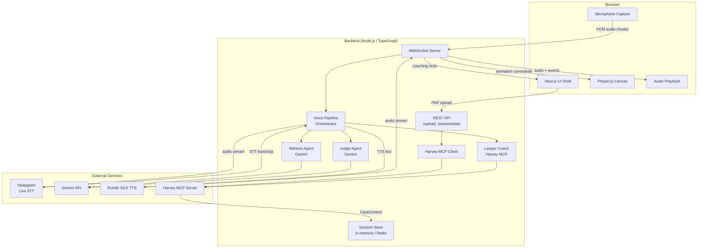
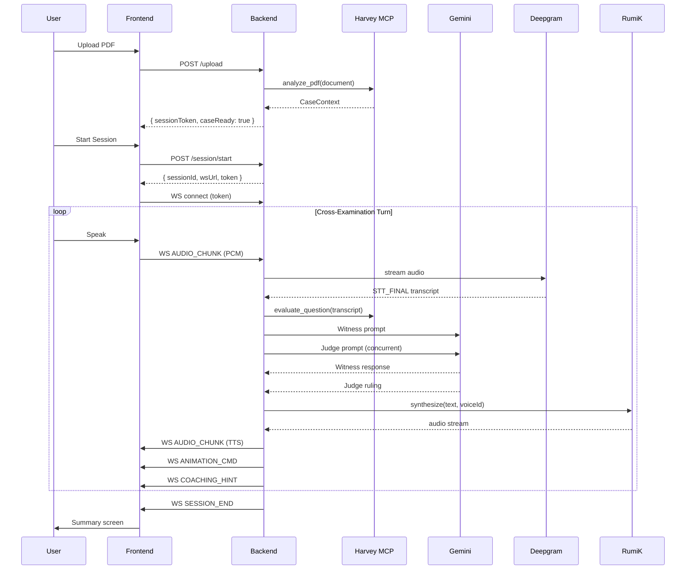

# Design Document: Pixel-Art Legal Cross-Examination Simulator

## Overview

The Pixel-Art Legal Cross-Examination Simulator is a real-time, voice-driven courtroom game. The user plays a cross-examining lawyer against AI-controlled Witness and Judge agents, all grounded in a case discovery PDF they upload before the session begins.

The system is composed of three major layers:

1. **Frontend** — A Next.js shell hosting a Phaser.js game canvas. The canvas renders pixel-art sprites and drives animations from WebSocket events. A React UI layer handles file upload, session controls, and the transcript summary screen.
2. **Backend** — A Node.js/TypeScript server exposing a REST API for session setup and a WebSocket server for real-time audio, agent responses, and animation commands.
3. **AI/Service Layer** — Deepgram Live Streaming STT, Gemini API (multi-agent), RumiK SILK TTS, and Harvey MCP. All credentials and tool calls live exclusively on the server.

Sessions are ephemeral: 10-minute hard cap, in-memory state, purged on termination.

---

## Architecture

### High-Level System Diagram



### Request / Session Lifecycle



---

## Components and Interfaces

### Frontend Components

#### `UploadScreen` (React)
- Renders the PDF drop-zone and upload button.
- Calls `POST /api/upload`, polls for `caseReady` status.
- Transitions to `SessionScreen` on success.

#### `SessionScreen` (React)
- Hosts the Phaser.js canvas via a `<div>` ref.
- Manages the WebSocket connection lifecycle.
- Renders the countdown timer, microphone indicator, and coaching hint overlay.
- On session end, transitions to `SummaryScreen`.

#### `SummaryScreen` (React)
- Displays the full session transcript in chronological order.
- Provides a "Play Again" button that resets to `UploadScreen`.

#### `PhaserGame` (Phaser.js Scene)
- Loads sprite sheets for Lawyer, Witness, and Judge characters.
- Maintains a state machine per sprite: `idle → talking → stressed → gavel-slam → zoom-in`.
- Listens to a shared `EventBus` (mitt or Phaser's built-in emitter) for `ANIMATION_CMD` events dispatched by the WebSocket handler.
- Renders at ≥30 FPS; uses Phaser's `requestAnimationFrame` loop.

#### `WebSocketClient` (TypeScript module)
- Wraps the browser `WebSocket` API.
- Handles reconnection with exponential backoff (max 3 retries, 2 s initial delay).
- Dispatches typed events to the `EventBus`.
- Streams microphone PCM chunks via `AudioWorkletProcessor`.

#### `MicrophoneCapture` (AudioWorklet)
- Captures raw PCM from `getUserMedia`.
- Sends 20 ms frames to the main thread for forwarding over WebSocket.
- Stops capture when a `VAD_INTERRUPT` event is received from the server (user interrupted TTS).

### Backend Modules

#### `REST API` (`src/api/`)
- `POST /api/upload` — accepts multipart PDF, validates size (≤20 MB) and MIME type, stores temporarily, triggers Harvey analysis, returns `{ uploadId }`.
- `GET /api/upload/:id/status` — returns `{ status: 'pending' | 'ready' | 'error', caseContext? }`.
- `POST /api/session/start` — creates `ActiveSession`, issues short-lived JWT session token, returns `{ sessionId, wsUrl, token }`.

#### `WebSocket Server` (`src/ws/`)
- Authenticates connections via JWT in the first message or query param.
- Routes messages by `type` to the `VoicePipelineOrchestrator`.
- Sends typed events back to the client.
- Enforces session TTL via a `setTimeout` hard-kill at 10 minutes.

#### `VoicePipelineOrchestrator` (`src/pipeline/`)
- Central coordinator for a single session.
- On `AUDIO_CHUNK`: forwards to Deepgram stream.
- On `STT_FINAL`: concurrently dispatches to `WitnessAgent`, `JudgeAgent`, and `LawyerCoach`.
- Collects agent responses, resolves objection logic, then sends TTS request.
- Emits `ANIMATION_CMD`, `COACHING_HINT`, `AGENT_RESPONSE`, `SESSION_END` back to the WebSocket layer.

#### `HarveyMCPClient` (`src/harvey/`)
- Wraps the Harvey MCP SDK.
- Exposes two methods:
  - `analyzeDocument(pdfBuffer): Promise<CaseContext>` — pre-session PDF analysis.
  - `evaluateQuestion(question, caseContext): Promise<CoachingHint>` — in-session question strength evaluation.
- Falls back to a base Gemini prompt if Harvey MCP is unavailable.

#### `WitnessAgent` (`src/agents/witness.ts`)
- Maintains a per-session Gemini chat history.
- System prompt includes `CaseContext` facts, arguments, and inconsistencies.
- Tracks `AgentState.witnessStress` (0–100); increments on inconsistency hits.
- Returns `{ text, stressLevel, objection? }`.

#### `JudgeAgent` (`src/agents/judge.ts`)
- Maintains a separate per-session Gemini chat history.
- System prompt includes courtroom rules and `CaseContext` summary.
- Tracks `AgentState.judgePatience` (0–100); decrements on sustained objections.
- Returns `{ ruling: 'sustained' | 'overruled' | 'warning' | 'contempt', text }`.

#### `SessionStore` (`src/store/`)
- In-memory `Map<sessionId, ActiveSession>`.
- Optional Redis adapter behind an interface for horizontal scaling.
- `create(sessionId)`, `get(sessionId)`, `update(sessionId, patch)`, `destroy(sessionId)`.
- `destroy` is called by the hard-kill timer and on explicit session end.

#### `TranscriptLogger` (`src/transcript/`)
- Appends `CourtroomTranscriptEntry` objects to the session's transcript array in real time.
- Serializes to JSON for the summary screen response.

---

## Data Models

```typescript
// Produced by Harvey MCP pre-session analysis
interface CaseContext {
  caseId: string;
  summary: string;
  evidenceItems: EvidenceItem[];
  keyFacts: string[];
  inconsistencies: Inconsistency[];
}

interface EvidenceItem {
  id: string;
  description: string;
  relevance: 'high' | 'medium' | 'low';
}

interface Inconsistency {
  id: string;
  description: string;
  involvedFacts: string[]; // references keyFacts entries
}

// Per-agent emotional/logical parameters
interface AgentState {
  witnessStress: number;   // 0–100; higher = more stressed
  judgePatience: number;   // 0–100; lower = less patient
  sustainedObjectionsInARow: number;
}

// The live session object held in SessionStore
interface ActiveSession {
  sessionId: string;
  token: string;           // JWT for WebSocket auth
  createdAt: number;       // Unix ms timestamp
  expiresAt: number;       // createdAt + 600_000
  caseContext: CaseContext;
  agentState: AgentState;
  transcript: CourtroomTranscriptEntry[];
  status: 'active' | 'ended' | 'expired';
  killTimer: NodeJS.Timeout;
}

// A single speaker turn in the transcript
interface CourtroomTranscriptEntry {
  entryId: string;         // UUID
  sessionId: string;
  speaker: 'lawyer' | 'witness' | 'judge' | 'system';
  text: string;
  timestamp: number;       // Unix ms
}

// Coaching hint returned by Harvey MCP in-session
interface CoachingHint {
  strength: 'strong' | 'moderate' | 'weak';
  suggestion: string;
  phase: 'pre-turn' | 'post-turn';
}
```

### WebSocket Message Protocol

All messages are JSON-encoded with a `type` discriminant.

**Client → Server**

| type | payload | description |
|---|---|---|
| `AUTH` | `{ token: string }` | First message; authenticates the WS connection |
| `AUDIO_CHUNK` | `{ data: Base64<PCM>, sampleRate: number }` | Raw microphone audio frame |
| `SESSION_END_REQUEST` | `{}` | User manually ends session |

**Server → Client**

| type | payload | description |
|---|---|---|
| `SESSION_READY` | `{ sessionId, expiresAt }` | Session is live |
| `STT_PARTIAL` | `{ text: string }` | Interim STT result for display |
| `STT_FINAL` | `{ text: string }` | Final STT result; pipeline begins |
| `AGENT_RESPONSE` | `{ speaker: 'witness'\|'judge', text: string }` | Agent text (shown while TTS plays) |
| `AUDIO_CHUNK` | `{ data: Base64<PCM>, speaker: 'witness'\|'judge' }` | TTS audio frame |
| `ANIMATION_CMD` | `{ target: 'witness'\|'judge'\|'lawyer', animation: AnimationType }` | Drive sprite state machine |
| `COACHING_HINT` | `{ hint: CoachingHint }` | Lawyer coaching overlay |
| `VAD_INTERRUPT` | `{}` | User speech detected; stop TTS playback |
| `TIMER_UPDATE` | `{ remainingMs: number }` | Countdown tick (every second) |
| `SESSION_END` | `{ reason: 'timeout'\|'contempt'\|'user', transcript: CourtroomTranscriptEntry[] }` | Session over |
| `ERROR` | `{ code: string, message: string }` | Non-fatal error notification |

```typescript
type AnimationType =
  | 'idle'
  | 'talking'
  | 'stressed'
  | 'very-stressed'
  | 'gavel-slam'
  | 'zoom-in'
  | 'contempt';
```

---

## Correctness Properties

*A property is a characteristic or behavior that should hold true across all valid executions of a system — essentially, a formal statement about what the system should do. Properties serve as the bridge between human-readable specifications and machine-verifiable correctness guarantees.*

